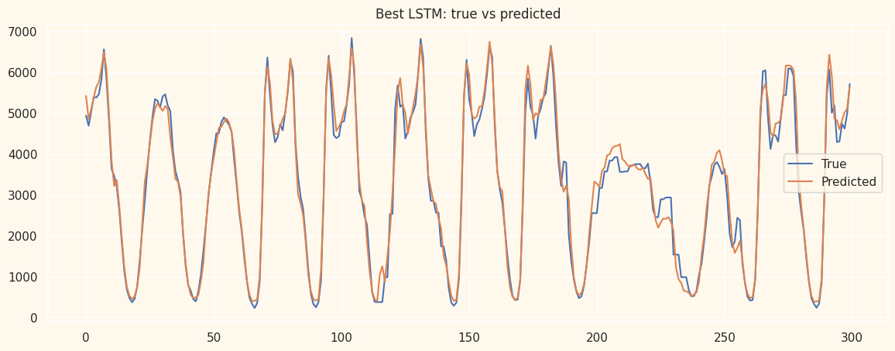

# Metro Traffic Forecasting

**LSTM and GRU for next-observation traffic prediction, with chronological validation and transparent experiment reporting.**

A time-series project built on the Metro Interstate Traffic Volume dataset: weather and calendar features, recurrent neural networks, optimizer/regularization comparisons, and persistence baselines.

*Figure from the saved source experiment. The revised notebook has not been retrained; see the protocol notes below.*

## Project highlights

- Prepared 48,204 source records with weather, traffic and calendar information.
- Engineered cyclical hour, weekday and month features and a calendar holiday indicator.
- Built 24-record windows with 13 input features, including past traffic observations.
- Compared LSTM and GRU across SGD, momentum SGD, RMSProp and Adam, with and without L1/L2 penalties: 24 configurations.
- Explored 48 LSTM configurations with early stopping and validation-based checkpoint selection.
- Compared neural predictions with last-observation and lag-24-observation baselines.
- Examined error accumulation in a conditional recursive forecast.

**Stack:** Python · Pandas · NumPy · PyTorch · scikit-learn · Matplotlib.

## Task and data

Given 24 preceding records, predict `traffic_volume` for the next record. Inputs include temperature, precipitation, cloud cover, weather category, cyclical calendar features, holiday status and traffic lags.

The source contains 48,204 rows and 9 columns, including the target. The historical run used 33,716 / 7,206 / 7,207 train/validation/test windows after filtering and window construction.

**Temporal scope matters:** the source series contains duplicate timestamps and gaps. A window of 24 records is not necessarily 24 hours; lag 24 is not necessarily the same hour yesterday. This repository describes the implemented next-record task and does not claim a validated one-hour-ahead forecasting service. To move to that task, aggregate duplicates, enforce a regular hourly horizon and re-evaluate.

## Recorded results

These are **historical notebook outputs**, not newly reproduced results of the revised code.

| Historical method | MAE | RMSE | R² |
|---|---:|---:|---:|
| LSTM + Adam + Huber, validation-selected configuration | 226.81 | 347.03 | 0.9694 |
| Last observation | 486.01 | 740.26 | 0.8608 |
| Lag 24 observations | 1,559.86 | 2,203.80 | -0.2339 |

The original exploratory comparison also inspected test metrics and ranked configurations by test RMSE. Consequently, the old test set was not an untouched holdout. Repeated timestamps further limit interpretation of the high R². The revised notebook uses validation for selection and delays test evaluation until the end; new metrics must be generated before claiming performance under the revised protocol.

[Detailed results and audit](RESULTS.md) · [Historical metrics CSV](historical_metrics.csv)

[Source Colab notebook](https://colab.research.google.com/drive/1mfHgVe3PZF1DpCGAG04IzswHB737mTv8?usp=sharing).
